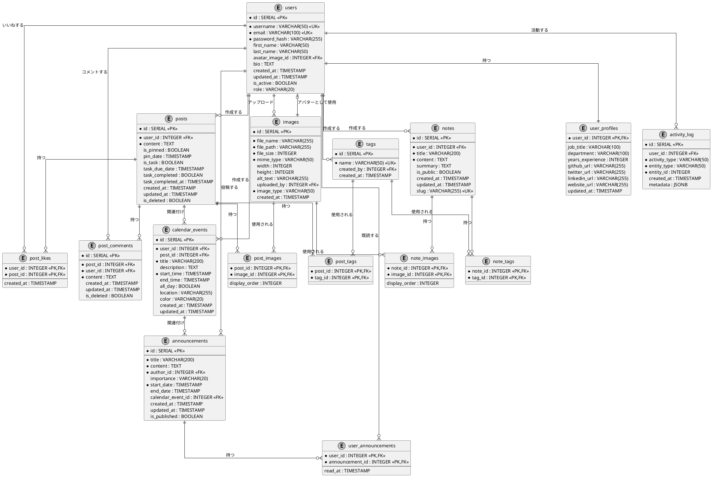

# ProjectStupro データベース設計

このドキュメントは、ProjectStupro（プロジェクトスタプロ）のデータベース設計を詳細に説明します。各テーブルの構造と目的、および主要な関連性について解説しています。

## 目次

1. [コアテーブル](#コアテーブル)
2. [リレーションテーブル](#リレーションテーブル)
3. [拡張機能対応テーブル](#拡張機能対応テーブル)
4. [イベントトラッキング](#イベントトラッキング)
5. [ER 図](#er図)

## コアテーブル

### users（ユーザー）テーブル

社員情報とログイン認証情報を管理するテーブル

| カラム名        | データ型                            | 説明                           |
| --------------- | ----------------------------------- | ------------------------------ |
| id              | SERIAL PRIMARY KEY                  | ユーザー ID                    |
| username        | VARCHAR(50) NOT NULL UNIQUE         | ユーザー名（ログイン用）       |
| email           | VARCHAR(100) NOT NULL UNIQUE        | メールアドレス                 |
| password_hash   | VARCHAR(255) NOT NULL               | パスワードハッシュ             |
| first_name      | VARCHAR(50)                         | 名                             |
| last_name       | VARCHAR(50)                         | 姓                             |
| avatar_image_id | INTEGER REFERENCES images(id)       | プロフィール画像 ID            |
| bio             | TEXT                                | 自己紹介文                     |
| created_at      | TIMESTAMP DEFAULT CURRENT_TIMESTAMP | 作成日時                       |
| updated_at      | TIMESTAMP DEFAULT CURRENT_TIMESTAMP | 更新日時                       |
| is_active       | BOOLEAN DEFAULT TRUE                | アクティブステータス           |
| role            | VARCHAR(20) DEFAULT 'user'          | ユーザー権限（user, admin 等） |

### posts（フィード投稿）テーブル

学習の進捗や気づきの共有、タスク管理を統合するテーブル

| カラム名          | データ型                              | 説明             |
| ----------------- | ------------------------------------- | ---------------- |
| id                | SERIAL PRIMARY KEY                    | 投稿 ID          |
| user_id           | INTEGER NOT NULL REFERENCES users(id) | 投稿者 ID        |
| content           | TEXT NOT NULL                         | 投稿内容         |
| is_pinned         | BOOLEAN DEFAULT FALSE                 | ピン止めフラグ   |
| pin_date          | TIMESTAMP                             | ピン止めした日時 |
| is_task           | BOOLEAN DEFAULT FALSE                 | タスクフラグ     |
| task_due_date     | TIMESTAMP                             | タスク期限       |
| task_completed    | BOOLEAN DEFAULT FALSE                 | タスク完了フラグ |
| task_completed_at | TIMESTAMP                             | タスク完了日時   |
| created_at        | TIMESTAMP DEFAULT CURRENT_TIMESTAMP   | 作成日時         |
| updated_at        | TIMESTAMP DEFAULT CURRENT_TIMESTAMP   | 更新日時         |
| is_deleted        | BOOLEAN DEFAULT FALSE                 | 論理削除フラグ   |

### user_profiles（ユーザープロフィール拡張）テーブル

ユーザーの追加情報を管理するテーブル

| カラム名         | データ型                                 | 説明                    |
| ---------------- | ---------------------------------------- | ----------------------- |
| user_id          | INTEGER PRIMARY KEY REFERENCES users(id) | ユーザー ID             |
| job_title        | VARCHAR(100)                             | 役職名                  |
| department       | VARCHAR(100)                             | 部署名                  |
| years_experience | INTEGER                                  | 経験年数                |
| github_url       | VARCHAR(255)                             | GitHub アカウント URL   |
| twitter_url      | VARCHAR(255)                             | Twitter アカウント URL  |
| linkedin_url     | VARCHAR(255)                             | LinkedIn アカウント URL |
| website_url      | VARCHAR(255)                             | 個人ウェブサイト URL    |
| updated_at       | TIMESTAMP DEFAULT CURRENT_TIMESTAMP      | 更新日時                |

### images（画像）テーブル

画像ファイルを一元管理するテーブル

| カラム名    | データ型                            | 説明                       |
| ----------- | ----------------------------------- | -------------------------- |
| id          | SERIAL PRIMARY KEY                  | 画像 ID                    |
| file_name   | VARCHAR(255) NOT NULL               | ファイル名                 |
| file_path   | VARCHAR(255) NOT NULL               | ファイルパス               |
| file_size   | INTEGER NOT NULL                    | ファイルサイズ(バイト)     |
| mime_type   | VARCHAR(50) NOT NULL                | MIME タイプ                |
| width       | INTEGER                             | 画像幅(px)                 |
| height      | INTEGER                             | 画像高さ(px)               |
| alt_text    | VARCHAR(255)                        | 代替テキスト               |
| uploaded_by | INTEGER REFERENCES users(id)        | アップロード者 ID          |
| image_type  | VARCHAR(50) NOT NULL                | 画像種類(avatar/post/note) |
| created_at  | TIMESTAMP DEFAULT CURRENT_TIMESTAMP | 作成日時                   |

### tags（タグ）テーブル

投稿やノートの分類に使用する自由なタグを管理するテーブル

| カラム名   | データ型                            | 説明      |
| ---------- | ----------------------------------- | --------- |
| id         | SERIAL PRIMARY KEY                  | タグ ID   |
| name       | VARCHAR(50) NOT NULL UNIQUE         | タグ名    |
| created_by | INTEGER REFERENCES users(id)        | 作成者 ID |
| created_at | TIMESTAMP DEFAULT CURRENT_TIMESTAMP | 作成日時  |

## リレーションテーブル

### post_likes（投稿いいね）テーブル

投稿に対する「いいね」を管理するテーブル

| カラム名    | データ型                            | 説明                  |
| ----------- | ----------------------------------- | --------------------- |
| user_id     | INTEGER REFERENCES users(id)        | いいねしたユーザー ID |
| post_id     | INTEGER REFERENCES posts(id)        | いいねされた投稿 ID   |
| created_at  | TIMESTAMP DEFAULT CURRENT_TIMESTAMP | いいねした日時        |
| PRIMARY KEY | (user_id, post_id)                  | 複合主キー            |

### post_comments（コメント）テーブル

投稿に対するコメントを管理するテーブル

| カラム名   | データ型                              | 説明                  |
| ---------- | ------------------------------------- | --------------------- |
| id         | SERIAL PRIMARY KEY                    | コメント ID           |
| post_id    | INTEGER NOT NULL REFERENCES posts(id) | コメント対象の投稿 ID |
| user_id    | INTEGER NOT NULL REFERENCES users(id) | コメント投稿者 ID     |
| content    | TEXT NOT NULL                         | コメント内容          |
| created_at | TIMESTAMP DEFAULT CURRENT_TIMESTAMP   | 作成日時              |
| updated_at | TIMESTAMP DEFAULT CURRENT_TIMESTAMP   | 更新日時              |
| is_deleted | BOOLEAN DEFAULT FALSE                 | 論理削除フラグ        |

### post_images（投稿画像関連付け）テーブル

投稿に添付された画像を管理するテーブル

| カラム名      | データ型                      | 説明       |
| ------------- | ----------------------------- | ---------- |
| post_id       | INTEGER REFERENCES posts(id)  | 投稿 ID    |
| image_id      | INTEGER REFERENCES images(id) | 画像 ID    |
| display_order | INTEGER DEFAULT 0             | 表示順序   |
| PRIMARY KEY   | (post_id, image_id)           | 複合主キー |

### post_tags（投稿タグ関連付け）テーブル

投稿に付けられたタグを管理するテーブル

| カラム名    | データ型                     | 説明       |
| ----------- | ---------------------------- | ---------- |
| post_id     | INTEGER REFERENCES posts(id) | 投稿 ID    |
| tag_id      | INTEGER REFERENCES tags(id)  | タグ ID    |
| PRIMARY KEY | (post_id, tag_id)            | 複合主キー |

### calendar_events（カレンダーイベント）テーブル

スケジュールとイベント管理のためのテーブル

| カラム名    | データ型                              | 説明                     |
| ----------- | ------------------------------------- | ------------------------ |
| id          | SERIAL PRIMARY KEY                    | イベント ID              |
| user_id     | INTEGER NOT NULL REFERENCES users(id) | 作成者 ID                |
| post_id     | INTEGER REFERENCES posts(id)          | 関連する投稿 ID（任意）  |
| title       | VARCHAR(200) NOT NULL                 | イベントタイトル         |
| description | TEXT                                  | イベント詳細             |
| start_time  | TIMESTAMP NOT NULL                    | 開始日時                 |
| end_time    | TIMESTAMP                             | 終了日時                 |
| all_day     | BOOLEAN DEFAULT FALSE                 | 終日イベントフラグ       |
| location    | VARCHAR(255)                          | 場所                     |
| color       | VARCHAR(20)                           | イベントカラー（表示用） |
| created_at  | TIMESTAMP DEFAULT CURRENT_TIMESTAMP   | 作成日時                 |
| updated_at  | TIMESTAMP DEFAULT CURRENT_TIMESTAMP   | 更新日時                 |

### announcements（お知らせ）テーブル

会社からの公式お知らせを管理するテーブル

| カラム名          | データ型                               | 説明                        |
| ----------------- | -------------------------------------- | --------------------------- |
| id                | SERIAL PRIMARY KEY                     | お知らせ ID                 |
| title             | VARCHAR(200) NOT NULL                  | お知らせタイトル            |
| content           | TEXT NOT NULL                          | お知らせ内容                |
| author_id         | INTEGER NOT NULL REFERENCES users(id)  | 投稿者 ID                   |
| importance        | VARCHAR(20) DEFAULT 'normal'           | 重要度（low, normal, high） |
| start_date        | TIMESTAMP NOT NULL                     | 掲載開始日                  |
| end_date          | TIMESTAMP                              | 掲載終了日                  |
| calendar_event_id | INTEGER REFERENCES calendar_events(id) | 関連イベント ID（任意）     |
| created_at        | TIMESTAMP DEFAULT CURRENT_TIMESTAMP    | 作成日時                    |
| updated_at        | TIMESTAMP DEFAULT CURRENT_TIMESTAMP    | 更新日時                    |
| is_published      | BOOLEAN DEFAULT TRUE                   | 公開状態                    |

### user_announcements（ユーザーお知らせ既読）テーブル

お知らせの既読状態を管理するテーブル

| カラム名        | データ型                             | 説明        |
| --------------- | ------------------------------------ | ----------- |
| user_id         | INTEGER REFERENCES users(id)         | ユーザー ID |
| announcement_id | INTEGER REFERENCES announcements(id) | お知らせ ID |
| read_at         | TIMESTAMP DEFAULT CURRENT_TIMESTAMP  | 既読日時    |
| PRIMARY KEY     | (user_id, announcement_id)           | 複合主キー  |

## 拡張機能対応テーブル

### notes（個人ノート）テーブル

個人の学習メモや知識を管理するテーブル

| カラム名   | データ型                              | 説明           |
| ---------- | ------------------------------------- | -------------- |
| id         | SERIAL PRIMARY KEY                    | ノート ID      |
| user_id    | INTEGER NOT NULL REFERENCES users(id) | 作成者 ID      |
| title      | VARCHAR(200) NOT NULL                 | ノートタイトル |
| content    | TEXT NOT NULL                         | ノート内容     |
| summary    | TEXT                                  | 要約           |
| is_public  | BOOLEAN DEFAULT FALSE                 | 公開フラグ     |
| created_at | TIMESTAMP DEFAULT CURRENT_TIMESTAMP   | 作成日時       |
| updated_at | TIMESTAMP DEFAULT CURRENT_TIMESTAMP   | 更新日時       |
| slug       | VARCHAR(255) UNIQUE                   | URL スラッグ   |

### note_tags（ノートタグ関連付け）テーブル

ノートに付けられたタグを管理するテーブル

| カラム名    | データ型                     | 説明       |
| ----------- | ---------------------------- | ---------- |
| note_id     | INTEGER REFERENCES notes(id) | ノート ID  |
| tag_id      | INTEGER REFERENCES tags(id)  | タグ ID    |
| PRIMARY KEY | (note_id, tag_id)            | 複合主キー |

### note_images（ノート画像関連付け）テーブル

ノートに添付された画像を管理するテーブル

| カラム名      | データ型                      | 説明       |
| ------------- | ----------------------------- | ---------- |
| note_id       | INTEGER REFERENCES notes(id)  | ノート ID  |
| image_id      | INTEGER REFERENCES images(id) | 画像 ID    |
| display_order | INTEGER DEFAULT 0             | 表示順序   |
| PRIMARY KEY   | (note_id, image_id)           | 複合主キー |

## イベントトラッキング

### activity_log（アクティビティログ）テーブル

システム上のユーザー活動を記録するテーブル

| カラム名      | データ型                            | 説明                        |
| ------------- | ----------------------------------- | --------------------------- |
| id            | SERIAL PRIMARY KEY                  | ログ ID                     |
| user_id       | INTEGER REFERENCES users(id)        | 実行したユーザー ID         |
| activity_type | VARCHAR(50) NOT NULL                | 活動種類                    |
| entity_type   | VARCHAR(50) NOT NULL                | 対象エンティティ種類        |
| entity_id     | INTEGER NOT NULL                    | 対象エンティティ ID         |
| created_at    | TIMESTAMP DEFAULT CURRENT_TIMESTAMP | 実行日時                    |
| metadata      | JSONB                               | 追加メタデータ（JSON 形式） |

## ER 図

以下は PlantUML 形式で表現した ER 図の定義です。PlantUML をサポートするツールを使用して視覚化できます。

## データベース設計のポイント

### 1. 機能ごとの主要テーブル

- **認証・ユーザー管理**: `users`, `user_profiles`
- **つぶやき/投稿機能**: `posts`, `post_comments`, `post_likes`, `post_tags`
- **タスク管理**: `posts`の拡張フィールド（タスク関連カラム）
- **カレンダー/スケジュール**: `calendar_events`
- **お知らせ機能**: `announcements`, `user_announcements`
- **知識共有**: `notes`, `note_tags`
- **メディア管理**: `images`（アバター、投稿、ノートの画像を一元管理）

### 2. 柔軟性を持たせた設計ポイント

- **タグシステム**: カテゴリー固定ではなく、ユーザー定義のタグで柔軟な分類が可能
- **投稿とタスクの統合**: 通常の投稿とタスクを一つのテーブルで管理し、機能を横断的に利用可能
- **画像管理の一元化**: 画像の基本情報は共通テーブルで管理しつつ、用途ごとの関連テーブルで関連付け
- **お知らせ機能とイベント連携**: お知らせとカレンダーイベントを連携可能な設計

### 3. 拡張性を考慮した設計

- **論理削除**: 重要データは物理削除せず、フラグで管理
- **メタデータ**: 将来の拡張を見据え、JSONB フィールドでの柔軟なデータ保存
- **モジュール分離**: 機能ごとに明確に分かれた設計で、将来のマイクロサービス化も容易

この設計は、初期段階ではシンプルに始め、プロダクトの成長に合わせて段階的に機能を拡張できる柔軟性を持っています。
